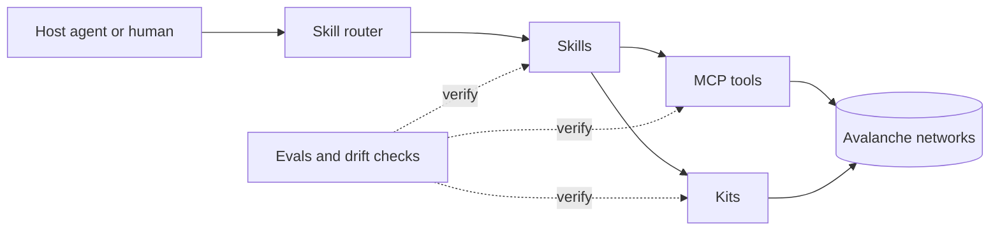

# Architecture

SnowShoe has five content layers and one quality layer. Each layer has a clear owner track.

## Layers

| Layer | Path | What it is | Owner track |
| --- | --- | --- | --- |
| Skills | `skills/` | Reviewed instructions for one job each | Skills |
| Tools | `packages/mcp-server/` | Executable operations exposed over MCP | MCP |
| Kits | `kits/` | Runnable starter repositories | Kits |
| Ideas | `ideas/` | Backlog of things to build and research | Ideas |
| Prompts | `prompts/` | System prompts for contributor tooling | Docs |
| Quality | `skills/*/evals/`, `scripts/`, CI | Evals, validation, drift checks | Evals |

## Skills

A skill is a Markdown file with structured frontmatter. It answers one question: how do I do this one thing on Avalanche? Skills belong to a journey:

| Journey | Purpose |
| --- | --- |
| `learn` | Concepts and environment setup |
| `idea` | From a rough idea to a scoped plan |
| `build` | Implementation tasks |
| `launch` | Deployment, verification, going public |
| `ecosystem` | Skills owned by a protocol team, in `skills/ecosystem/<protocol>/` |

Protocol teams own their own ecosystem skills. This keeps knowledge close to the people who know it.

## Tools

The MCP server exposes operations an agent cannot perform from text alone. Every tool is listed in `tools.manifest.json` with a name, description, network scope, and a `readOnly` flag. Tools that write on chain require an explicit confirmation parameter.

The size of the tool surface is a design decision. See [ADR 0002](decisions/0002-minimal-tool-surface.md).

## Kits

A kit is a runnable repository directory with a `kit.json`. A kit has one purpose, a stated time to first run, and a `.env.example` with placeholder values.

## Distribution

How skills reach a user's agent is an open decision. See [ADR 0001](decisions/0001-distribution-model.md).

## Quality

- **Validation.** `npm run validate` checks structure, metadata, links, style, and secrets.
- **Evals.** Every `verified` skill has eval cases in `evals/cases.json`. See [evals](evals.md).
- **Drift checks.** A weekly workflow flags verified skills not re-verified within 90 days.
- **Review.** Every change to skills, tools, and kits has two approvals.

## Design principles

1. **Fuji first.** Test on the testnet before mainnet.
2. **Small tool surface.** Add a tool only when a skill cannot do the job.
3. **Secrets stay out.** No key material in the repository, in skill text, or in tool arguments that persist to logs.
4. **Confirm before writing.** Any state-changing step names the action and waits for confirmation.
5. **One source of truth.** Downstream projects link or depend on releases. They do not copy content.
6. **Boring tooling.** Scripts have no dependencies. Anyone can read and run them.
